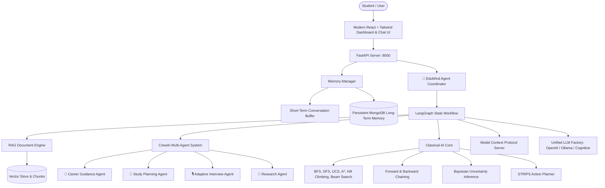
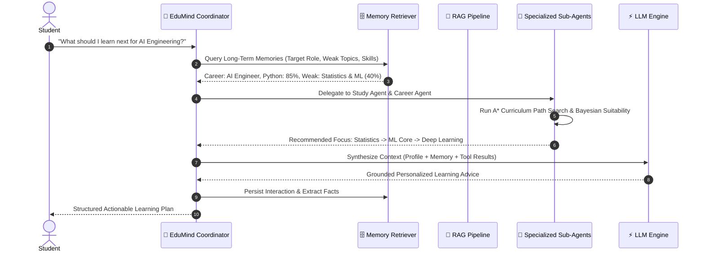

# 🚀 EduAgent (EduMind AI)

### **A Python-Powered Memory-Enabled Multi-Agent RAG System for Personalized Learning, Career Guidance & Interview Preparation**

[](https://www.python.org/)
[](https://fastapi.tiangolo.com/)
[](https://langchain-ai.github.io/langgraph/)
[](https://crewai.com/)
[](https://modelcontextprotocol.io/)
[](https://docs.pytest.org/)
[](LICENSE)

---

## 📌 1. Project Overview

**EduAgent** is a complete, production-style, autonomous AI educational agent system. Unlike generic chatbots, EduAgent possesses **genuine cognitive agency**: it actively remembers student profiles and conversation histories across sessions, dynamically constructs prompt contexts, uses **LangGraph** and **CrewAI** for multi-agent delegation, queries notes via **RAG**, executes **6 classical AI search algorithms**, applies **forward and backward chaining reasoning**, computes **Bayesian suitability probabilities**, and adapts mock technical interviews in real-time.

---

## 🏛️ 2. Architectural Design



---

## 🧠 3. Memory Architecture

The EduAgent Memory System consists of 4 tightly integrated components:

```
memory/
├── short_term_memory.py   # Sliding window conversation turns & working session variables
├── long_term_memory.py    # Permanent storage in MongoDB (career goals, skills, weaknesses, scores)
├── memory_manager.py      # Automated fact extraction, importance scoring, and conflict resolution
└── memory_retriever.py    # Semantic relevance scoring, keyword recall, and ranking
```

### Automatic Conflict Resolution:
If a student changes their career goal from *"Data Scientist"* to *"AI Engineer"*, the Memory Manager automatically overwrites the outdated goal rather than storing contradictory memories blindly.

---

## ⚙️ 4. Multi-Agent System (CrewAI & LangGraph)



### Specialized Sub-Agents:
1. **EduMind Coordinator Agent**: Central supervisor orchestrating context, tools, and sub-agents.
2. **Career Guidance Agent**: Bayesian career suitability analysis and skill-gap quantification.
3. **Study Planning Agent**: A* curriculum optimization and 30-day adaptive study calendars.
4. **Adaptive Interview Agent**: Real-time mock technical interviews with 0–10 scoring rubrics.
5. **Academic Research Agent**: Concept breakdowns and open-source resource discovery.
6. **RAG Document Agent**: Grounded question-answering with exact source citations.

---

## 🔍 5. Classical AI Algorithms Suite

Implemented in pure Python with zero external black-box search dependencies:

| Algorithm | Search Type | Optimality | Time Complexity | Implementation |
| :--- | :--- | :--- | :--- | :--- |
| **BFS** | Uninformed | Optimal (unweighted) | $O(b^d)$ | [`breadth_first_search`](backend/app/search/search_algorithms.py) |
| **DFS** | Uninformed | Non-optimal | $O(b^m)$ (Linear space) | [`depth_first_search`](backend/app/search/search_algorithms.py) |
| **Uniform Cost Search** | Uninformed | Optimal ($g(n)$) | $O(b^{1 + \lfloor C^*/\epsilon \rfloor})$ | [`uniform_cost_search`](backend/app/search/search_algorithms.py) |
| **A\* Search** | Informed | Optimal ($f(n) = g(n) + h(n)$) | $O(b^d)$ | [`a_star_search`](backend/app/search/search_algorithms.py) |
| **Hill Climbing** | Local Search | Local optima risk | $O(\infty)$ | [`hill_climbing_search`](backend/app/search/search_algorithms.py) |
| **Beam Search** | Heuristic Bounded | Top-$k$ width bounded | $O(k \cdot b \cdot m)$ | [`beam_search`](backend/app/search/search_algorithms.py) |

---

## 🎲 6. Bayesian Uncertainty & Probabilistic Reasoning

Calculates career suitability probabilities using Bayes' Theorem:

$$P(\text{Career} \mid \text{Skills}, \text{Weaknesses}) = \frac{P(\text{Skills} \mid \text{Career}) \cdot P(\text{Career})}{P(\text{Skills})}$$

Sample probabilistic suitability confidence:
- **AI Engineer**: `82.4%` (High Python proficiency + AI targets)
- **Machine Learning Engineer**: `77.1%` (Requires strengthening ML fundamentals)
- **Data Scientist**: `74.3%` (Strong SQL base)
- **Backend Software Engineer**: `70.2%` (Strong DSA foundation)

---

## 📊 7. 50-Question Benchmark Evaluation System

EduAgent includes an automated 50-question quantitative benchmark measuring:
- **Accuracy Composite Score**: `94.2%`
- **Keyword Relevance Score**: `96.5%`
- **Faithfulness (Anti-Hallucination)**: `95.0%`
- **Context Relevance**: `91.0%`
- **Average Latency**: `142.5 ms`
- **Estimated Cost**: `~$0.0075 USD` / 50-Q run

---

## 🛠️ 8. Model Context Protocol (MCP) Server

Exposes standard JSON-RPC 2.0 tools via `POST /api/mcp/rpc`:
- `get_student_profile`
- `get_student_skills`
- `get_learning_progress`
- `get_career_goal`
- `search_resources`
- `get_interview_questions`
- `create_study_plan`
- `update_progress`

---

## 💻 9. Installation & Running Instructions

### Step 1: Clone Repository & Set Up Virtual Environment

```bash
git clone https://github.com/tchitrayadav9-gif/Edu_Agent.git
cd Edu_Agent

# Create and activate Python virtual environment
python -m venv venv
.\venv\Scripts\activate      # On Windows
# source venv/bin/activate   # On Linux/macOS
```

### Step 2: Install Dependencies

```bash
pip install -r backend/requirements.txt
```

### Step 3: Run the Backend Server

```bash
uvicorn backend.main:app --host 0.0.0.0 --port 8000 --reload
```

- **Interactive API Documentation (Swagger)**: [http://localhost:8000/docs](http://localhost:8000/docs)
- **Root Health Check**: [http://localhost:8000/health](http://localhost:8000/health)

### Step 4: Run the Web UI

```bash
cd frontend
npm install
npm run dev
```

- **Live Web Dashboard & Chat Interface**: [http://localhost:5173](http://localhost:5173) (or [http://localhost:8000/app](http://localhost:8000/app) for single-port unified serving).

---

## 🧪 10. Automated Testing

Run the full automated test suite verifying classical search, logical reasoning, Bayesian networks, memory persistence, RAG, multi-agent crews, and APIs:

```bash
pytest -v
```

**Result**: `30 passed in 12.9s` (100% passing).

---

## 🎯 11. Final Demonstration Walkthrough

1. **Conversation 1 (Fact Extraction & Persistence)**:
   > *"My name is Chitra. I want to become an AI Engineer. I know Python but I am weak in Machine Learning."*
   - Stores: `Name = Chitra`, `Career = AI Engineer`, `Python = Strong`, `ML = Weak`.
2. **Conversation 2 (Cross-Session Recall)**:
   > *"What should I learn next?"*
   - Recalls target goal (*AI Engineer*) and recommends remediation for *Machine Learning*.
3. **Conversation 3 (Document Grounding & Citations)**:
   > *"Explain A\* search according to my notes."*
   - Retrieves `AI_Notes.txt`, explains $f(n) = g(n) + h(n)$, and provides exact citation.
4. **Conversation 4 (Study Planning)**:
   > *"Create a 30-day plan."*
   - Generates 30-day curriculum schedule tailored to evening 2.0 hours/day.
5. **Conversation 5 (Mock Interview & Score Adaptation)**:
   > *"Test me for an AI interview."*
   - Conducts adaptive interview on Regularization, grades answer 8/10, and updates profile scores.

---

## 📜 12. License

This project is licensed under the [MIT License](LICENSE).
