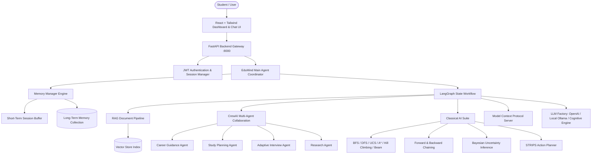
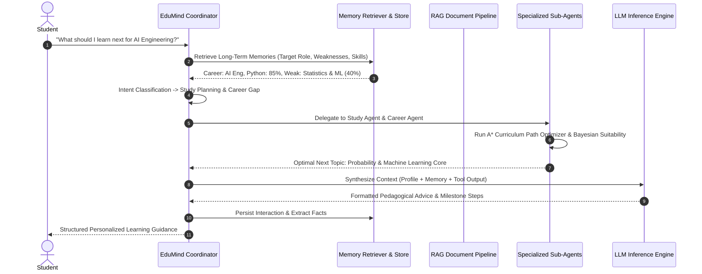

# 🏛️ EduAgent Architecture & System Design

EduAgent is a production-style, Python-powered memory-enabled multi-agent RAG platform designed for personalized academic guidance, career roadmap planning, and adaptive mock interview preparation.

---

## 1. High-Level System Architecture

---

## 2. Multi-Agent Collaboration Flow (CrewAI & LangGraph)

---

## 3. Dynamic Prompt Context Engineering

The system dynamically constructs the LLM context prior to every inference step:

$$\text{Context} = \text{Query} + \text{STM}_{\text{recent}} + \text{LTM}_{\text{retrieved}} + \text{Profile} + \text{RAG}_{\text{citations}} + \text{Tools}_{\text{output}}$$

---

## 4. Search & Optimization Algorithms

1. **Breadth-First Search (BFS)**: Unweighted state expansion using FIFO queue.
2. **Depth-First Search (DFS)**: Deep path exploration with LIFO stack.
3. **Uniform Cost Search (UCS)**: Dijkstra lowest path cost $g(n)$ expansion.
4. **A\* Search**: Optimal heuristic search using $f(n) = g(n) + h(n)$ with admissible heuristic $h(n) \le h^*(n)$.
5. **Hill Climbing**: Greedy local search moving strictly to lower heuristic states.
6. **Beam Search**: Heuristic search maintaining top-$k$ paths at each depth horizon.
